# MCP Server Integration Guide

## Übersicht

Dieser Guide erklärt, wie alle MCP Server in `mcp_plugins/servers` sinnvoll in das EventFixTeam integriert werden.

## Architektur

```mermaid
graph TB
    subgraph "EventFixTeam"
        EFT[EventFixTeamMCP]
        MSR[MCP Server Registry]
    end
    
    subgraph "MCP Server"
        D[Docker MCP Server]
        R[Redis MCP Server]
        P[PostgreSQL MCP Server]
        PL[Playwright MCP Server]
        FS[Filesystem MCP Server]
        G[Git MCP Server]
        GH[GitHub MCP Server]
        BS[Brave Search MCP Server]
        T[Tavily MCP Server]
        C7[Context7 MCP Server]
        DT[Desktop MCP Server]
        M[Memory MCP Server]
        S[Supabase MCP Server]
        Q[Qdrant MCP Server]
        PR[Prisma MCP Server]
        N[NPM MCP Server]
        N8[n8n MCP Server]
        F[Fetch MCP Server]
        TM[TaskManager MCP Server]
    end
    
    EFT --> MSR
    MSR --> D
    MSR --> R
    MSR --> P
    MSR --> PL
    MSR --> FS
    MSR --> G
    MSR --> GH
    MSR --> BS
    MSR --> T
    MSR --> C7
    MSR --> DT
    MSR --> M
    MSR --> S
    MSR --> Q
    MSR --> PR
    MSR --> N
    MSR --> N8
    MSR --> F
    MSR --> TM
```



## MCP Server Registry

Die MCP Server Registry (`mcp_plugins/servers/mcp_server_registry.py`) verwaltet alle verfügbaren MCP Server.

### Verfügbare MCP Server

| Server | Typ | Tools | Priorität |
|--------|------|-------|-----------|
| Docker | `docker` | Container Management | 100 |
| Redis | `redis` | Database Tools | 90 |
| PostgreSQL | `postgres` | Database Tools | 90 |
| Playwright | `playwright` | Browser Automation | 80 |
| Filesystem | `filesystem` | File Operations | 100 |
| Git | `git` | Version Control | 70 |
| GitHub | `github` | GitHub API | 60 |
| Brave Search | `brave-search` | Search API | 50 |
| Tavily | `tavily` | Search & Extraction | 50 |
| Context7 | `context7` | Documentation | 40 |
| Desktop | `desktop` | Desktop Automation | 30 |
| Memory | `memory` | Memory Storage | 30 |
| Supabase | `supabase` | Database Tools | 60 |
| Qdrant | `qdrant` | Vector Database | 60 |
| Prisma | `prisma` | ORM Tools | 50 |
| NPM | `npm` | Package Manager | 40 |
| n8n | `n8n` | Workflow Automation | 40 |
| Fetch | `fetch` | HTTP Fetch | 30 |
| TaskManager | `taskmanager` | Task Management | 30 |

## EventFixTeam mit MCP Server Registry

### Initialisierung

```python
from src.teams.event_fix_team_mcp import create_event_fix_team_mcp
from mcp_plugins.servers.mcp_server_registry import get_registry

# MCP Server Registry initialisieren
registry = get_registry()

# EventFixTeam mit MCP Server Registry erstellen
team = await create_event_fix_team_mcp(
    working_dir=".",
    output_dir="./event_fix_output",
    mcp_registry=registry,
    use_mcp_tools=True,
    enable_docker=True,
    enable_redis=True,
    enable_postgres=True,
    enable_playwright=True,
    enable_filesystem=True,  # Für Code-Write
)

# Team starten
await team.start()
```

### Fix-Task erstellen

```python
from src.teams.event_fix_team_mcp import FixTaskType, FixPriority

# Fix-Task erstellen
task = await team.create_fix_task(
    task_type=FixTaskType.FIX_CODE,
    priority=FixPriority.HIGH,
    description="Fix division by zero error",
    file_path="src/app.py",
    suggested_fix="Add zero check before division",
    metadata={
        "container": "my-app",
        "service": "api-service",
    },
)
```

### Tasks verarbeiten

```python
# Tasks verarbeiten
result = await team.process_tasks(max_tasks=10)

print(f"Success: {result.success}")
print(f"Tasks Created: {result.tasks_created}")
print(f"Tasks Completed: {result.tasks_completed}")
print(f"Errors: {result.errors}")
```

### Status abrufen

```python
# Status abrufen
status = team.get_status()

print(f"Session ID: {status['session_id']}")
print(f"Running: {status['running']}")
print(f"Pending Tasks: {status['pending_tasks']}")
print(f"Completed Tasks: {status['completed_tasks']}")
print(f"MCP Sessions: {status['mcp_sessions']}")
print(f"Enabled Servers: {status['enabled_servers']}")
```

## MCP Tool Calls

### Docker Tools

```python
# Container-Logs abrufen
result = await team._call_mcp_tool(
    server_type=MCPServerType.DOCKER,
    tool_name="get_container_logs",
    tool_args={
        "container_name": "my-app",
        "tail": 100,
    },
)
```

### Redis Tools

```python
# Keys mit Pattern suchen
result = await team._call_mcp_tool(
    server_type=MCPServerType.REDIS,
    tool_name="get_keys_pattern",
    tool_args={
        "pattern": "user:*",
    },
)
```

### PostgreSQL Tools

```python
# Langsame Queries abrufen
result = await team._call_mcp_tool(
    server_type=MCPServerType.POSTGRES,
    tool_name="get_slow_queries",
    tool_args={},
)
```

### Playwright Tools

```python
# E2E-Test ausführen
result = await team._call_mcp_tool(
    server_type=MCPServerType.PLAYWRIGHT,
    tool_name="run_e2e_test",
    tool_args={
        "url": "http://localhost:3000",
        "selector": "#submit-button",
        "action": "click",
    },
)
```

### Filesystem Tools (Code-Write)

```python
# Datei schreiben
result = await team._call_mcp_tool(
    server_type=MCPServerType.FILESYSTEM,
    tool_name="write_file",
    tool_args={
        "path": "src/app.py",
        "content": "def divide(a, b):\n    if b == 0:\n        raise ValueError('Division by zero')\n    return a / b",
    },
)
```

## Konfiguration

### EventFixConfig

```python
@dataclass
class EventFixConfig:
    # Paths
    working_dir: str
    output_dir: str = "./event_fix_output"
    
    # MCP Server Konfiguration
    mcp_registry: Optional[MCPServerRegistry] = None
    use_mcp_tools: bool = True
    
    # Tool Aktivierung
    enable_docker_tools: bool = True
    enable_redis_tools: bool = True
    enable_postgres_tools: bool = True
    enable_playwright_tools: bool = True
    enable_filesystem_tools: bool = True
    
    # Execution
    max_concurrent_tasks: int = 5
    timeout_seconds: int = 300
```

## Beispiele

### Beispiel 1: Container Crash beheben

```python
import asyncio
from src.teams.event_fix_team_mcp import create_event_fix_team_mcp, FixTaskType, FixPriority

async def fix_container_crash():
    # EventFixTeam erstellen
    team = await create_event_fix_team_mcp(
        working_dir=".",
        use_mcp_tools=True,
    )
    
    await team.start()
    
    # Fix-Task erstellen
    task = await team.create_fix_task(
        task_type=FixTaskType.FIX_CODE,
        priority=FixPriority.CRITICAL,
        description="Container crashed with exit code 1",
        file_path="src/main.py",
        suggested_fix="Add error handling for database connection",
        metadata={
            "container": "my-app",
            "exit_code": 1,
        },
    )
    
    # Tasks verarbeiten
    result = await team.process_tasks(max_tasks=1)
    
    print(f"Result: {result.to_dict()}")
    
    await team.stop()

asyncio.run(fix_container_crash())
```

### Beispiel 2: Schema-Migration planen

```python
import asyncio
from src.teams.event_fix_team_mcp import create_event_fix_team_mcp, FixTaskType, FixPriority

async def plan_migration():
    # EventFixTeam erstellen
    team = await create_event_fix_team_mcp(
        working_dir=".",
        use_mcp_tools=True,
    )
    
    await team.start()
    
    # Migrations-Task erstellen
    task = await team.create_fix_task(
        task_type=FixTaskType.MIGRATION,
        priority=FixPriority.HIGH,
        description="Add new column to users table",
        file_path="migrations/001_add_email_column.py",
        suggested_fix="ALTER TABLE users ADD COLUMN email VARCHAR(255);",
        metadata={
            "source_schema": "v1",
            "target_schema": "v2",
            "rollback_plan": "ALTER TABLE users DROP COLUMN email;",
        },
    )
    
    # Tasks verarbeiten
    result = await team.process_tasks(max_tasks=1)
    
    print(f"Result: {result.to_dict()}")
    
    await team.stop()

asyncio.run(plan_migration())
```

### Beispiel 3: Test-Failure beheben

```python
import asyncio
from src.teams.event_fix_team_mcp import create_event_fix_team_mcp, FixTaskType, FixPriority

async def fix_test_failure():
    # EventFixTeam erstellen
    team = await create_event_fix_team_mcp(
        working_dir=".",
        use_mcp_tools=True,
    )
    
    await team.start()
    
    # Test-Fix-Task erstellen
    task = await team.create_fix_task(
        task_type=FixTaskType.TEST_FIX,
        priority=FixPriority.HIGH,
        description="E2E test failed: Submit button not clickable",
        file_path="tests/e2e/login.spec.ts",
        suggested_fix="Wait for form validation before enabling submit button",
        metadata={
            "test_url": "http://localhost:3000/login",
            "test_selector": "#submit-button",
            "screenshot_path": "screenshots/test_failure.png",
        },
    )
    
    # Tasks verarbeiten
    result = await team.process_tasks(max_tasks=1)
    
    print(f"Result: {result.to_dict()}")
    
    await team.stop()

asyncio.run(fix_test_failure())
```

## Vorteile der MCP Server Integration

1. **Zentralisierte Verwaltung** - Alle MCP Server werden zentral verwaltet
2. **Flexibilität** - Server können einfach aktiviert/deaktiviert werden
3. **Erweiterbarkeit** - Neue MCP Server können einfach hinzugefügt werden
4. **Konsistenz** - Alle Tools verwenden das gleiche MCP Interface
5. **Wiederverwendbarkeit** - MCP Server können von anderen Teams verwendet werden

## Nächste Schritte

1. **Tests erstellen** - Unit-Tests und Integration-Tests
2. **Performance-Optimierung** - MCP Session Pooling
3. **Monitoring** - Metriken und Logging
4. **Dokumentation** - API-Dokumentation und Beispiele

## Lizenz

MIT
