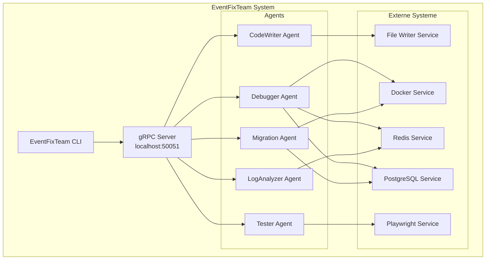

# EventFixTeam System

Ein verteiltes, gRPC-basiertes Agent-System für Event-Fixes und Code-Verbesserungen.

## 📋 Übersicht

Das EventFixTeam System ist ein spezialisiertes Coding-Team für Event-Fixes, das aus mehreren spezialisierten Agents besteht, die über gRPC kommunizieren. Die Agents führen keine direkten Code-Änderungen durch, sondern erstellen Tasks für andere Systeme.

## 🏗️ Architektur



## 🤖 Agents

### 1. CodeWriter Agent
- **Zweck**: Erstellt Tasks für Code-Änderungen
- **Funktion**: Analysiert Anforderungen und erstellt strukturierte Tasks für den File Writer Service
- **Keine direkten Code-Änderungen**

### 2. Debugger Agent
- **Zweck**: Debuggt Probleme und analysiert Fehler
- **Funktion**: 
  - Analysiert Logs aus Redis
  - Überprüft Datenbank-Status (PostgreSQL)
  - Erstellt Debug-Tasks
- **Keine direkten Code-Änderungen**

### 3. Tester Agent
- **Zweck**: Führt Funktionstests durch
- **Funktion**:
  - Erstellt Test-Tasks für Playwright
  - Analysiert Test-Ergebnisse
  - Erstellt Bug-Reports bei Fehlern
- **Keine direkten Code-Änderungen**

### 4. Migration Agent
- **Zweck**: Verwaltet Datenbank-Migrationen
- **Funktion**:
  - Erstellt Migrations-Tasks
  - Überwacht Docker-Container
  - Analysiert PostgreSQL-Status
- **Keine direkten Code-Änderungen**

### 5. LogAnalyzer Agent
- **Zweck**: Analysiert Logs und identifiziert Probleme
- **Funktion**:
  - Liest Logs aus Redis
  - Identifiziert Fehlermuster
  - Erstellt Analyse-Berichte
- **Keine direkten Code-Änderungen**

## 🚀 Installation

### Voraussetzungen
- Python 3.8+
- Docker (für externe Services)
- PostgreSQL
- Redis
- Playwright

### Installation

```bash
# Abhängigkeiten installieren
cd mcp_plugins/servers/grpc_host
pip install -r requirements.txt

# gRPC-Code generieren
python -m grpc_tools.protoc -I./proto --python_out=./proto --grpc_python_out=./proto ./proto/agent_service.proto
```

## 📖 Verwendung

### System starten

```bash
# Alle Komponenten starten
python mcp_plugins/servers/start_eventfixteam.py
```

### CLI verwenden

```bash
# CLI starten
python mcp_plugins/servers/eventfixteam_cli.py

# Beispiel: Code-Task erstellen
python mcp_plugins/servers/eventfixteam_cli.py create-task --type code --description "Fix login bug"

# Beispiel: Debug-Task erstellen
python mcp_plugins/servers/eventfixteam_cli.py create-task --type debug --description "Analyze error logs"

# Beispiel: Test-Task erstellen
python mcp_plugins/servers/eventfixteam_cli.py create-task --type test --description "Test user registration"
```

### System testen

```bash
# Test-Skript ausführen
python mcp_plugins/servers/test_grpc_system.py
```

## 🔧 Konfiguration

### gRPC Server
- **Port**: 50051
- **Host**: localhost

### Agent-Konfiguration
Jeder Agent hat eine eigene Konfigurationsdatei im `config/` Verzeichnis:

```json
{
  "agent_id": "code_writer_1",
  "agent_type": "code_writer",
  "capabilities": ["code_analysis", "task_creation"],
  "max_concurrent_tasks": 5
}
```

## 📊 Task-Typen

### Code Tasks
```json
{
  "task_type": "code",
  "file_path": "src/app.py",
  "changes": [
    {
      "line": 42,
      "old_code": "def old_function():",
      "new_code": "def new_function():"
    }
  ]
}
```

### Debug Tasks
```json
{
  "task_type": "debug",
  "log_source": "redis",
  "error_pattern": "ConnectionError",
  "analysis_depth": "deep"
}
```

### Test Tasks
```json
{
  "task_type": "test",
  "test_framework": "playwright",
  "test_file": "tests/login.spec.js",
  "test_cases": ["login_success", "login_failure"]
}
```

### Migration Tasks
```json
{
  "task_type": "migration",
  "database": "postgresql",
  "migration_file": "migrations/001_add_users.sql",
  "rollback": true
}
```

### Log Analysis Tasks
```json
{
  "task_type": "log_analysis",
  "log_source": "redis",
  "time_range": "1h",
  "error_level": "error"
}
```

## 🔍 Monitoring

### Agent-Status prüfen
```bash
# Alle Agents auflisten
python mcp_plugins/servers/eventfixteam_cli.py list-agents

# Agent-Details anzeigen
python mcp_plugins/servers/eventfixteam_cli.py agent-status --agent-id code_writer_1
```

### Task-Status prüfen
```bash
# Alle Tasks auflisten
python mcp_plugins/servers/eventfixteam_cli.py list-tasks

# Task-Details anzeigen
python mcp_plugins/servers/eventfixteam_cli.py task-status --task-id <task-id>
```

## 🧪 Entwicklung

### Neuen Agent hinzufügen

1. Agent-Klasse erstellen:
```python
# grpc_host/agents/new_agent.py
from .base_agent import BaseAgent

class NewAgent(BaseAgent):
    def __init__(self, agent_id: str):
        super().__init__(agent_id, "new_agent")
    
    async def process_task(self, task: Task) -> TaskResult:
        # Implementierung
        pass
```

2. Agent im Server registrieren:
```python
# grpc_host/grpc_server.py
from agents.new_agent import NewAgent

# Im __init__:
self.agents["new_agent_1"] = NewAgent("new_agent_1")
```

3. Agent im Start-Skript hinzufügen:
```python
# start_eventfixteam.py
agents = [
    # ...
    ("NewAgent", "new_agent_1")
]
```

## 📝 Best Practices

1. **Keine direkten Code-Änderungen**: Agents erstellen nur Tasks
2. **Asynchrone Verarbeitung**: Alle Agent-Operationen sind asynchron
3. **Fehlerbehandlung**: Alle Fehler werden protokolliert und zurückgegeben
4. **Task-Tracking**: Jeder Task hat eine eindeutige ID und Status
5. **Ressourcen-Management**: Agents begrenzen gleichzeitige Tasks

## 🐛 Troubleshooting

### gRPC-Verbindungsfehler
```bash
# Prüfen, ob Server läuft
netstat -an | grep 50051

# Server-Logs prüfen
# Logs werden in grpc_host/logs/ gespeichert
```

### Agent reagiert nicht
```bash
# Agent-Status prüfen
python mcp_plugins/servers/eventfixteam_cli.py agent-status --agent-id <agent-id>

# Agent neu starten
# Stoppen Sie das System und starten Sie es neu
```

### Task hängt fest
```bash
# Task abbrechen
python mcp_plugins/servers/eventfixteam_cli.py cancel-task --task-id <task-id>

# Task-Logs prüfen
# Logs werden in grpc_host/logs/tasks/ gespeichert
```

## 📚 Weiterführende Dokumentation

- [gRPC Python Dokumentation](https://grpc.io/docs/languages/python/)
- [Protocol Buffers Guide](https://developers.google.com/protocol-buffers)
- [Docker Dokumentation](https://docs.docker.com/)
- [Playwright Dokumentation](https://playwright.dev/)

## 🤝 Beitrag

Beiträge sind willkommen! Bitte erstellen Sie einen Pull Request oder öffnen Sie ein Issue.

## 📄 Lizenz

MIT License

## 👥 Autoren

EventFixTeam Development Team

---

**Hinweis**: Dieses System ist Teil des Coding Engine Projekts und dient als spezialisiertes Team für Event-Fixes und Code-Verbesserungen.
