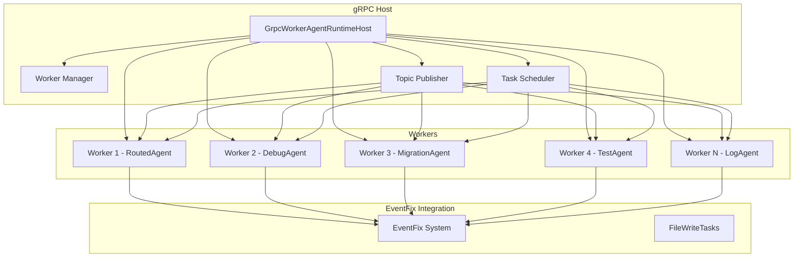

# gRPC-basierte verteilte Agent-Architektur

## Übersicht

Dieses Paket implementiert eine gRPC-basierte verteilte Agent-Architektur für das EventFixTeam System.

## Architektur



## Komponenten

### 1. GrpcWorkerAgentRuntimeHost ([`grpc_host.py`](grpc_host.py))
- gRPC-Server, der auf einem Port lauscht
- Verwaltet Worker-Verbindungen
- Registriert Worker-Agenten
- Verteilt Tasks an Worker basierend auf Kapazität und Verfügbarkeit
- Überwacht Worker-Status

### 2. RoutedAgent ([`routed_agent.py`](routed_agent.py))
- Ein Agent, der Tasks verarbeiten kann
- Subscribiert zu Topics für neue Tasks
- Verarbeitet Tasks und sendet Ergebnisse zurück
- Unterstützt verschiedene Task-Typen (fix_code, migrate, test, log)

### 3. GrpcWorkerAgentRuntime ([`grpc_worker_runtime.py`](grpc_worker_runtime.py))
- Verbindet sich mit dem GrpcWorkerAgentRuntimeHost
- Registriert eine Agent-Instanz (z.B. RoutedAgent)
- Empfängt Tasks vom Host
- Verarbeitet Tasks und sendet Ergebnisse zurück
- Publisht Status-Updates

### 4. EventFix System ([`event_fix/`](event_fix/))
- Bestehendes Multi-Agent-System für Event-Fixes
- FileWriteTasks für Task-Management
- Society of Mind für Agent-Koordination

## Installation

### Abhängigkeiten installieren

```bash
# gRPC-Abhängigkeiten installieren
pip install grpcio grpcio-tools

# Autogen-Abhängigkeiten installieren
pip install autogen-ext[grpc]
```

### Umgebungsvariablen konfigurieren

```bash
# .env.example kopieren
cp .env.example .env

# Umgebungsvariablen anpassen
# GRPC_HOST=127.0.0.1
# GRPC_PORT=50051
# EVENT_PORT=50050
```

## Verwendung

### gRPC Host starten

```bash
# gRPC Host starten
python mcp_plugins/servers/grpc_host.py \
  --host 127.0.0.1 \
  --port 50051 \
  --event-port 50050
```

### RoutedAgent starten

```bash
# RoutedAgent starten
python mcp_plugins/servers/routed_agent.py \
  --worker-id routed_agent_1 \
  --host 127.0.0.1 \
  --port 50051 \
  --capabilities fix_code migrate test log
```

### GrpcWorkerAgentRuntime starten

```bash
# GrpcWorkerAgentRuntime starten
python mcp_plugins/servers/grpc_worker_runtime.py \
  --worker-id worker_runtime_1 \
  --host 127.0.0.1 \
  --port 50051 \
  --agent-type routed_agent
```

## gRPC API

### RegisterWorker
```python
from grpc_host_pb2 import RegisterWorkerRequest
request = RegisterWorkerRequest(
    worker_id="worker_1",
    worker_type="routed_agent",
    capabilities=["fix_code", "migrate", "test", "log"]
)
response = stub.RegisterWorker(request)
```

### DistributeTask
```python
from grpc_host_pb2 import DistributeTaskRequest
import json

task_data = {
    "task_id": "fix_123",
    "task_type": "fix_code",
    "file_path": "src/app.py",
    "description": "Fix division by zero error"
}

request = DistributeTaskRequest(
    task_type="fix_code",
    task_data=json.dumps(task_data)
)
response = stub.DistributeTask(request)
```

### CollectTaskResult
```python
from grpc_host_pb2 import CollectTaskResultRequest
import json

result = {
    "success": True,
    "message": "Task completed successfully",
    "actions_taken": ["Read file", "Applied fix", "Saved file"]
}

request = CollectTaskResultRequest(
    worker_id="worker_1",
    task_id="fix_123",
    result=json.dumps(result)
)
response = stub.CollectTaskResult(request)
```

## Vorteile

- **Skalierbarkeit**: Einfach hinzufügen von neuen Workern
- **Ausfallsicherheit**: Wenn ein Worker ausfällt, übernehmen andere die Tasks
- **Lastverteilung**: Tasks werden intelligent auf Worker verteilt
- **Flexibilität**: Verschiedene Agent-Typen können als Worker laufen

## Lizenz

MIT
