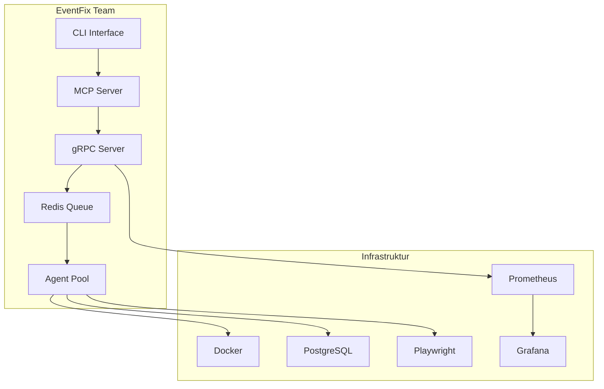
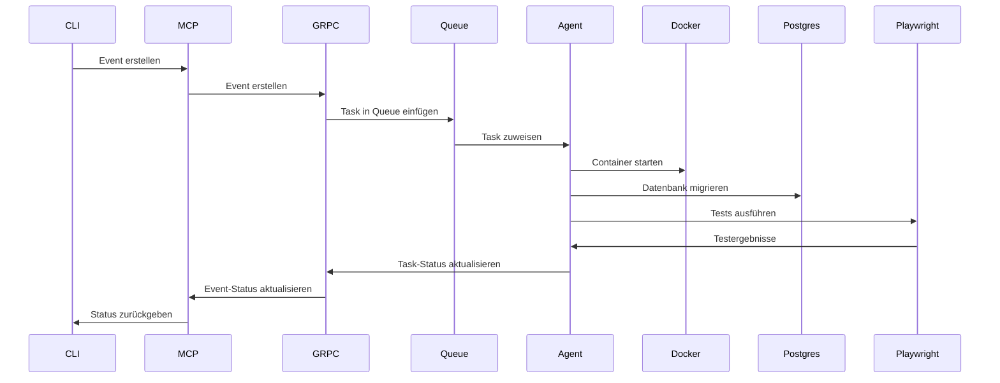

# EventFix Team - MCP Server & Agent Team

## Übersicht

Das EventFix Team ist ein dediziertes Coding-Team für Event-Fixes, das auf einer verteilten gRPC-basierten Agent-Architektur aufbaut. Die Agents schreiben keinen Code direkt, sondern erstellen Tasks für andere Systeme (z.B. file_write) und senden Fix-Tasks an Docker, Redis, PostgreSQL zum Debuggen und Funktionstests mit Playwright.

## Architektur



## Komponenten

### 1. CLI Interface (`cli.py`)

Befehlszeilen-Interface zur Interaktion mit dem EventFix Team.

**Verfügbare Befehle:**

```bash
# Event erstellen
python cli.py event create --type "bug" --severity "high" --description "Fix login bug"

# Event-Status prüfen
python cli.py event status --event-id "evt_123"

# Event-Logs anzeigen
python cli.py event logs --event-id "evt_123"

# Agent-Status prüfen
python cli.py agent status --agent-id "agent_1"

# System-Status prüfen
python cli.py system status

# Metriken abrufen
python cli.py metrics --type "agents"
```

### 2. MCP Server (`mcp_server.py`)

Model Context Protocol Server für die Integration mit verschiedenen AI-Systemen.

**Verfügbare Tools:**

- `create_event`: Erstellt ein neues Event
- `get_event_status`: Ruft den Status eines Events ab
- `get_event_logs`: Ruft Logs eines Events ab
- `get_agent_status`: Ruft den Status eines Agents ab
- `get_system_status`: Ruft den Systemstatus ab
- `get_metrics`: Ruft Metriken ab

### 3. gRPC Server (`grpc_server.py`)

Verteilter gRPC-Server für die Agent-Kommunikation.

**Verfügbare Services:**

- `AgentService`: Registriert und verwaltet Agents
- `EventService`: Verwaltet Events
- `TaskService`: Verwaltet Tasks
- `MetricsService`: Exponiert Metriken

### 4. Agent Pool

Verschiedene spezialisierte Agents:

- **CodeGeneratorAgent**: Erstellt Code-Tasks (file_write)
- **DockerAgent**: Verwaltet Docker-Container
- **PostgresAgent**: Verwaltet PostgreSQL-Datenbanken
- **PlaywrightAgent**: Führt Funktionstests durch
- **DebugAgent**: Analysiert Logs und Fehler

## Installation

### Voraussetzungen

- Python 3.9+
- Docker
- PostgreSQL
- Redis
- Node.js (für Playwright)

### Installation

```bash
# Abhängigkeiten installieren
pip install -r requirements.txt

# gRPC-Code generieren
cd mcp_plugins/servers/grpc_host
python -m grpc_tools.protoc -I./proto --python_out=./proto --grpc_python_out=./proto ./proto/agent_service.proto

# Docker-Container starten
docker-compose up -d
```

## Konfiguration

### Umgebungsvariablen

```bash
# gRPC Server
GRPC_HOST=localhost
GRPC_PORT=50051

# Redis
REDIS_HOST=localhost
REDIS_PORT=6379
REDIS_DB=0

# PostgreSQL
POSTGRES_HOST=localhost
POSTGRES_PORT=5432
POSTGRES_DB=eventfix
POSTGRES_USER=eventfix
POSTGRES_PASSWORD=eventfix_password

# Playwright
PLAYWRIGHT_HEADLESS=true
PLAYWRIGHT_TIMEOUT=30000

# Prometheus
PROMETHEUS_HOST=localhost
PROMETHEUS_PORT=9090
```

### Konfigurationsdatei (`config.json`)

```json
{
  "grpc": {
    "host": "localhost",
    "port": 50051
  },
  "redis": {
    "host": "localhost",
    "port": 6379,
    "db": 0
  },
  "postgres": {
    "host": "localhost",
    "port": 5432,
    "database": "eventfix",
    "user": "eventfix",
    "password": "eventfix_password"
  },
  "playwright": {
    "headless": true,
    "timeout": 30000
  },
  "agents": {
    "code_generator": {
      "enabled": true,
      "max_concurrent_tasks": 5
    },
    "docker": {
      "enabled": true,
      "max_concurrent_tasks": 3
    },
    "postgres": {
      "enabled": true,
      "max_concurrent_tasks": 3
    },
    "playwright": {
      "enabled": true,
      "max_concurrent_tasks": 2
    },
    "debug": {
      "enabled": true,
      "max_concurrent_tasks": 5
    }
  }
}
```

## Verwendung

### CLI verwenden

```bash
# Event erstellen
python cli.py event create --type "bug" --severity "high" --description "Fix login bug"

# Event-Status prüfen
python cli.py event status --event-id "evt_123"

# Event-Logs anzeigen
python cli.py event logs --event-id "evt_123"

# Agent-Status prüfen
python cli.py agent status --agent-id "agent_1"

# System-Status prüfen
python cli.py system status

# Metriken abrufen
python cli.py metrics --type "agents"
```

### MCP Server verwenden

```python
from mcp_server import EventFixMCPServer

# Server initialisieren
server = EventFixMCPServer()

# Event erstellen
event = server.create_event(
    type="bug",
    severity="high",
    description="Fix login bug"
)

# Event-Status prüfen
status = server.get_event_status(event_id="evt_123")

# Event-Logs anzeigen
logs = server.get_event_logs(event_id="evt_123")

# Agent-Status prüfen
agent_status = server.get_agent_status(agent_id="agent_1")

# System-Status prüfen
system_status = server.get_system_status()

# Metriken abrufen
metrics = server.get_metrics(type="agents")
```

### gRPC Server verwenden

```python
import grpc
from proto.agent_service_pb2 import RegisterAgentRequest, CreateEventRequest
from proto.agent_service_pb2_grpc import AgentServiceStub, EventServiceStub

# Verbindung zum gRPC Server herstellen
channel = grpc.insecure_channel('localhost:50051')

# Agent registrieren
agent_stub = AgentServiceStub(channel)
response = agent_stub.RegisterAgent(
    RegisterAgentRequest(
        agent_id="agent_1",
        agent_type="code_generator",
        capabilities=["code_generation", "file_write"]
    )
)

# Event erstellen
event_stub = EventServiceStub(channel)
event = event_stub.CreateEvent(
    CreateEventRequest(
        type="bug",
        severity="high",
        description="Fix login bug"
    )
)
```

## Agent-Workflow



## Monitoring

### Prometheus

Prometheus sammelt Metriken von allen Komponenten:

- gRPC Server Metriken
- Agent Metriken
- Redis Metriken
- PostgreSQL Metriken
- System Metriken

### Grafana

Grafana visualisiert die Metriken in Dashboards:

- Agent Performance Dashboard
- Event Processing Dashboard
- System Health Dashboard
- Error Rate Dashboard

### Alerts

Alerts werden konfiguriert in `alerts.yml`:

- gRPC Server Down
- Redis Down
- PostgreSQL Down
- Agent Task Queue Backlog
- Agent High Failure Rate
- High CPU Usage
- High Memory Usage
- Disk Space Low

## Entwicklung

### Neuen Agent hinzufügen

1. Neue Agent-Klasse erstellen:

```python
from agents.base_agent import BaseAgent

class MyCustomAgent(BaseAgent):
    def __init__(self, agent_id: str, config: dict):
        super().__init__(agent_id, "my_custom", config)
    
    async def process_task(self, task: Task) -> TaskResult:
        # Task verarbeiten
        result = await self._do_something(task)
        return TaskResult(
            task_id=task.task_id,
            status="completed",
            result=result
        )
    
    async def _do_something(self, task: Task) -> dict:
        # Implementierung
        pass
```

2. Agent registrieren:

```python
from grpc_server import EventFixGRPCServer

server = EventFixGRPCServer()
server.register_agent(MyCustomAgent("agent_1", config))
```

### Neuen Task-Typ hinzufügen

1. Task-Typ definieren:

```python
from dataclasses import dataclass
from enum import Enum

class TaskType(Enum):
    CODE_GENERATION = "code_generation"
    DOCKER_DEPLOY = "docker_deploy"
    POSTGRES_MIGRATE = "postgres_migrate"
    PLAYWRIGHT_TEST = "playwright_test"
    MY_CUSTOM_TASK = "my_custom_task"

@dataclass
class MyCustomTask:
    task_id: str
    type: TaskType
    data: dict
    priority: int = 5
    created_at: datetime = field(default_factory=datetime.utcnow)
```

2. Task-Handler implementieren:

```python
from agents.base_agent import BaseAgent

class MyCustomAgent(BaseAgent):
    async def process_task(self, task: Task) -> TaskResult:
        if task.type == TaskType.MY_CUSTOM_TASK:
            return await self._process_my_custom_task(task)
        else:
            return await super().process_task(task)
    
    async def _process_my_custom_task(self, task: Task) -> TaskResult:
        # Implementierung
        pass
```

## Testing

### Unit Tests

```bash
# Alle Tests ausführen
pytest tests/

# Spezifische Tests ausführen
pytest tests/test_agents.py
pytest tests/test_grpc_server.py
```

### Integration Tests

```bash
# Integration Tests ausführen
pytest tests/integration/

# Mit Docker
docker-compose up -d
pytest tests/integration/
docker-compose down
```

### E2E Tests

```bash
# E2E Tests ausführen
pytest tests/e2e/

# Mit Playwright
pytest tests/e2e/ --playwright
```

## Troubleshooting

### gRPC Server startet nicht

```bash
# Prüfen, ob Port bereits belegt
netstat -ano | findstr :50051

# Port freigeben
taskkill /PID <PID> /F
```

### Redis Verbindung fehlgeschlagen

```bash
# Redis Status prüfen
redis-cli ping

# Redis Logs prüfen
docker logs redis
```

### PostgreSQL Verbindung fehlgeschlagen

```bash
# PostgreSQL Status prüfen
docker exec postgres pg_isready

# PostgreSQL Logs prüfen
docker logs postgres
```

### Agent reagiert nicht

```bash
# Agent-Status prüfen
python cli.py agent status --agent-id "agent_1"

# Agent-Logs prüfen
docker logs agent_1
```

## Deployment

### Docker

```bash
# Docker-Image bauen
docker build -t eventfix-team .

# Container starten
docker run -d -p 50051:50051 eventfix-team
```

### Docker Compose

```bash
# Alle Services starten
docker-compose up -d

# Logs anzeigen
docker-compose logs -f

# Services stoppen
docker-compose down
```

### Kubernetes

```bash
# Deployen
kubectl apply -f k8s/

# Status prüfen
kubectl get pods

# Logs anzeigen
kubectl logs -f deployment/eventfix-grpc-server
```

## Contributing

1. Fork das Repository
2. Erstelle einen Feature-Branch (`git checkout -b feature/my-feature`)
3. Commit deine Änderungen (`git commit -am 'Add my feature'`)
4. Push zum Branch (`git push origin feature/my-feature`)
5. Erstelle einen Pull Request

## License

MIT License

## Kontakt

Bei Fragen oder Problemen kontaktiere uns unter:
- Email: support@eventfix.team
- Discord: https://discord.gg/eventfix
- GitHub: https://github.com/eventfix/team
